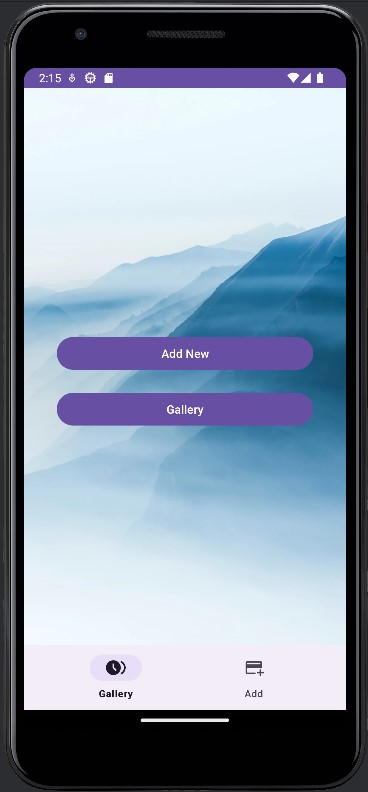
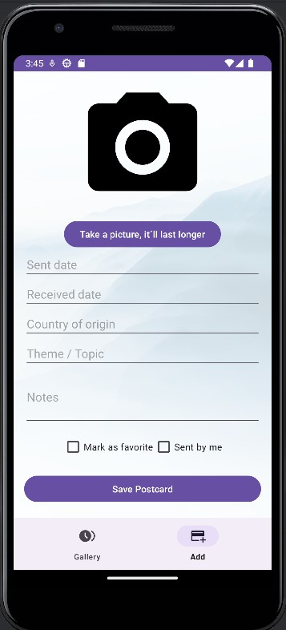

# PostcardStorehouse - Postcard Management App

PostcardStorehouse is an Android application designed for postcard collectors and enthusiasts. 
It allows you to digitally document, organize, and browse your postcard collection.

_This app was born from a client need to better manage growing postcard collection. 
It aims to be simple, offline-first, and tailored for collectors who value visual documentation._

## Preview
<div style="display: flex; gap: 10px; align-items: flex-start;">
  
  
</div>

## Features

- **Postcard saving**: Take photos of postcards using your device's camera or select images from your gallery
- **Image availability**: All photos taken of postcards are saved to your device’s media gallery, making them accessible to other apps
- **Detailed information**: Add the following details to each postcard:
    - Sent date
    - Received date
    - Country of origin
    - Theme/topic
    - Notes
    - Favorite
    - Is sent by user
    - Photos
- **Browsing and search**: Browse postcards in a visual gallery view
- **Filtering**: Filter postcards by country, theme, date, and other attributes
- **Local functionality**: All data is stored locally on your device — no internet connection required

## Requirements

- Android 6.0 (Marshmallow) or newer
- Camera (for taking photos)
- Storage space for saving postcard images

## Installation

_Installation instructions will be added once the first working version is released._

## Build Instructions

_Build instructions will be added once the first working version is released._

## Development

- Bottom navigation for intuitive switching between main screens

- Modular fragment-based UI architecture

### Project Structure

```
app/
├── src/
│   ├── main/
│   │   ├── java/com/maalelan/postcardstorehouse/
│   │   │   ├── activities/                         # Activities
│   │   │   ├── adapters/                           # 
│   │   │   ├── fragments/                          # UI fragments (View layer)
|   |   |   ├── viewmodels/                         # ViewModel layer
│   │   │   ├── repositories/                       # Repository layer
│   │   │   ├── models/                             # Data models (Model layer)
│   │   │   │   └── database/                       # Database operations and entities
│   │   │   │       ├── entities/ 
│   │   │   │       └── dao/
│   │   │   ├── navigation/                         # Navigation
│   │   │   └── utils/                              # Helper classes
│   │   └── res/                                    # Resources
│   │       ├── layout/                             # Fragment/activity layouts
│   │       ├── menu/                               # Menu resources (e.g., bottom nav items)
│   │       ├── navigation/                         # Navigation graph
│   │       └── values/                             # Strings, colors, themes, etc.
└── build.gradle                                    # Gradle-config.
```

### Technologies

- Development environment: Android Studio
- Programming language: Java
- Database: SQLite / Room Persistence Library
- Image capture: Android Camera API / CameraX
- Image storage: MediaStore API (Android 10+) / External Storage Directory (Android 9 and below)

## Contact

If you have questions or would like to contribute, feel free to get in touch via GitHub 
